# Documentación del proyecto Tienda de ropa

## Índice
1. [storesApiController](#documentación-storesapicontroller)
    - [Función `showingStores()`](#función-showingstores)
    - [Función `showingStore()`](#función-showingstore)
    - [Función `newStore()`](#función-newstore)
    - [Función `deleteStore()`](#función-deletestore)
    - [Función `updateStore()`](#función-updatestore)
2. [productsApiController](#documentación-productsapicontroller)
    - [Función `getproducts()`](#función-getproducts)
    - [Función `getproduct()`](#función-getproduct)
    - [Función `addproduct()`](#función-addProduct)
    - [Función `deleteproduct()`](#función-deleteproduct)
    - [Función `updateproduct()`](#función-updateproduct)
3. [authApiController](#documentación-authapicontroller)
    - [Función `login()`](#función-login)


___

# Documentación `storesApiController`

## Introducción
El storesApiController es una clase encargada de manejar las solicitudes relacionadas con las tiendas dentro de nuestra aplicación.

## Función `showingStores()`

### Descripción
La función `showingStores` del controlador obtiene todas las tiendas de la base de datos y envía una respuesta adecuada al cliente basado en el resultado. Además, se encarga de enviar parámetros de ordenación en caso de que los haya.

## Ejemplos de uso:
### Ejemplo 1: Obtener todas las tiendas de manera exitosa.
### Method : `GET`.
### URL : `tiendaDeRopaAPI/api/stores`.
### Atributos para los parámetros : `attribute`, `order`.
### Url con parámetros : `tiendaDeRopaAPI/api/stores?attribute=telefono&order=DESC`.

En la siguiente imagen se demuestra el ejemplo sin parámetros.

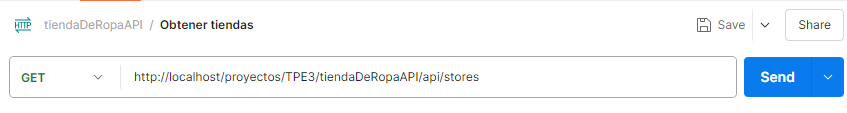

Si hay tiendas en la base de datos, la función enviará una respuesta con código 200 y las tiendas en formato JSON:
```json
{
    "status": 200,
    "data": [
        {
            "id_tienda": 1,
            "nombre": "Urban clothing BA",
            "direccion": "Montevideo 181",
            "telefono": 11617287,
            "email": "urbanclothingba@gmail.com"
        },
        ...
    ]
}
```
## Ejemplos de uso Query Params
 En el siguiente texto se demuestran los posibles parámetros que puede recibir la URL:
- **attribute**: Permite filtrar por atributos, los valores que puede tomar son los siguientes:
    - id_tienda
    - nombre
    - direccion
    - telefono
    - email
    
- **order**: Permite ordenar dichos atributos, los valores que puede tomar son los siguientes:
    - ASC
    - DESC

Imagen donde se muestra el uso de parámetros en la URL:

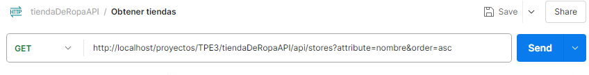

A su vez los parámetros se pueden colocar en la sección 'Params' de POSTMAN de la siguiente forma:

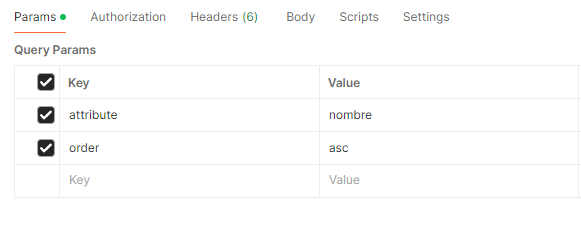

### Ejemplo 2: Tiendas no encontradas

Si no existen tiendas en la base de datos, la función enviará una respuesta con código 404 y un mensaje de error:
```json
    "No existen tiendas en la base de datos"
```

### Ejemplo 3: Error de servidor

Si ocurre un error del servidor, la función enviará una respuesta con código 500 y un mensaje de error:

```json
 "Error de servidor"
```

___

## Función `showingStore()`

### Descripción
La función `showingStore` del controlador obtiene una tienda específica de la base de datos mediante el ID y envía una respuesta adecuada al cliente basado en el resultado.

### Parámetros
**`$params (array)`: Un array asociativo que contiene los parámetros de la solicitud. En este caso, se espera que contenga '`:ID`', el identificador de la tienda que se desea obtener.**


## Ejemplos de uso:
### Ejemplo 1: Obtener la tienda solicitada de forma exitosa.
### Method : `GET`.
### Params: `{id}`.
### URL : `tiendaDeRopaAPI/api/stores/2`.

En la siguiente imagen se demuestra el ejemplo.

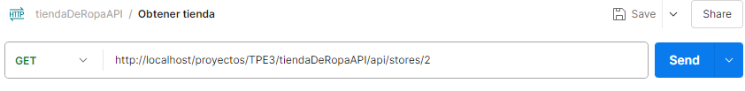

Si la tienda requerida existe en la base de datos, la función enviará una respuesta con código 200 y la tienda en formato JSON:

```json
{
    "status": 200,
    "message": {
        "id_tienda": 2,
        "nombre": "Urban clothing Cba",
        "direccion": "Ameghino 110",
        "telefono": 351569877,
        "email": "urbanclothingcba@gmail.com"
    }
}
```
### Ejemplo 2: Tienda no encontrada

Si no existe la tienda demandada en la base de datos, la función enviará una respuesta con código 404 y un mensaje de error:

```json
 "No existe la tienda en la base de datos."
```

### Ejemplo 3: Error de servidor

Si ocurre un error del servidor, la función enviará una respuesta con código 500 y un mensaje de error:

```json
 "Error de servidor"
```

___


## Función `newStore()`

### Descripción
La función `newStore` del controlador agrega una nueva tienda y envía una respuesta adecuada al cliente basado en el resultado.

## Ejemplos de uso:

### Ejemplo 1: Crear una nueva tienda de forma exitosa.
### Method : `POST`.
### URL : `tiendaDeRopaAPI/api/stores`.

En la siguiente imagen se demuestra el ejemplo de la URL:

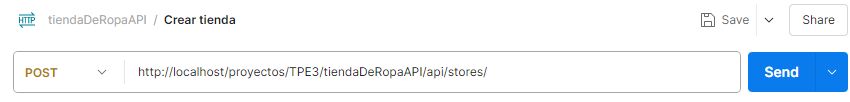

A su vez se debe escribir los atributos y su valor en el body en formato raw para poder generar la nueva tienda. Ejemplo:

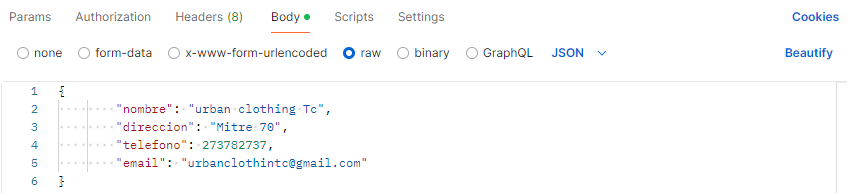


Si la tienda fue agregada correctamente, la función enviará una respuesta con código 201:

```json
{
    "status": 201,
    "msg": "Se agrego con éxito la tienda con id 7",
    "tienda": {
        "id_tienda": 7,
        "nombre": "urban clothing Tc",
        "direccion": "Mitre 70",
        "telefono": 273782737,
        "email": "urbanclothintc@gmail.com"
    }
}
```

### Ejemplo 2: Error en la solicitud al agregar la tienda

Si la tienda que se intentó añadir no logra concretarse por falta de datos, la función enviará una respuesta con código 400 y un mensaje de error:
```json
 "Complete los datos"
```

### Ejemplo 3: Error de servidor

Si ocurre un error del servidor, la función enviará una respuesta con código 500 y un mensaje de error:

```json
"Error de servidor"
```

___

## Función `deleteStore()`

### Descripción
La función `deleteStore` del controlador recibe el ID de una tienda para posteriormente eliminarla y envía una respuesta adecuada al cliente basado en el resultado.

### Parámetros
**`$params (array)`: Un array asociativo que contiene los parámetros de la solicitud. En este caso, se espera que contenga '`:ID`', el identificador de la tienda que se desea eliminar.**


## Ejemplos de uso:

### Ejemplo 1: Eliminar una tienda de forma exitosa.
### Method : `DELETE`.
### Params: `{id}`.
### URL : `tiendaDeRopaAPI/api/stores/3`.

En la siguiente imagen se demuestra el ejemplo de la URL:

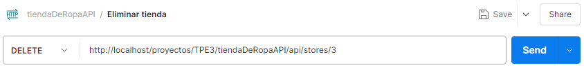

Si la tienda solicitada para eliminar existe en la base de datos, la función enviará una respuesta con código 200:

```json
"Tienda 3, eliminada"
```

### Ejemplo 2: Tienda no encontrada

Si no existe la determinada tienda en la base de datos, la función enviará una respuesta con código 404 y un mensaje de error:

```json
 "Tienda 3, no encontrada"
```

### Ejemplo 3: Error de servidor

Si ocurre un error del servidor, la función enviará una respuesta con código 500 y un mensaje de error:

```json
"Error de servidor"
```

___

## Función `updateStore()`

### Descripción
La función `updateStore` del controlador recibe un ID de una tienda de la base de datos para modificar los atributos de la misma y envía una respuesta adecuada al cliente basado en el resultado.

### Parámetros
**`$params (array)`: Un array asociativo que contiene los parámetros de la solicitud. En este caso, se espera que contenga '`:ID`', el identificador de la tienda que se desea obtener.**

## Ejemplos de uso:

### Ejemplo 1: Editar una tienda de forma exitosa.
### Method : `PUT`.
### Params: `{id}`.
### URL : `tiendaDeRopaAPI/api/stores/1`.

En la siguiente imagen se demuestra el ejemplo de la URL:

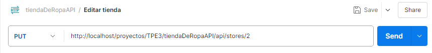

Al igual que al crear una tienda, se debe incluir los datos que se quieran modificar en el body en formato raw. Ejemplo, en el cual se modificó la dirección:

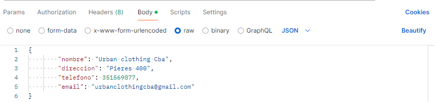

Si la tienda elegida existe en la base de datos y fue modificada correctamente, la función enviará una respuesta con código 200:

```json
"Tienda urban clothing Cba, modificada"
```

### Ejemplo 2: Tienda no encontrada

Si no existe la tienda en la base de datos, la función enviará una respuesta con código 404 y un mensaje de error:
```json
"Tienda urban clothing Cba, no encontrada"
```

### Ejemplo 3: Error de servidor

Si ocurre un error del servidor, la función enviará una respuesta con código 500 y un mensaje de error:

```json
"Error de servidor"
```
___

# Documentación `authApiController`

## Introducción
El authApiController es una clase encargada de manejar el inicio de sesión dentro de nuestra aplicación.

## Función `login()`

### Descripción
La función `login` del controlador obtiene los datos de inicio de sesión y envía una respuesta adecuada al cliente basado en el resultado.

## Ejemplos de uso
### Ejemplo 1: Iniciar Sesión.
### Method : `POST`.
### URL : `tiendaDeRopaAPI/api/auth`.

En la siguiente imagen se demuestra el ejemplo.

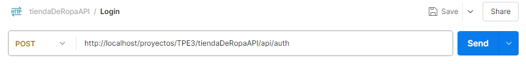

Se debe agregar los atributos con sus valores para poder iniciar sesión. Esto se realiza en el body de forma raw. Ejemplo:

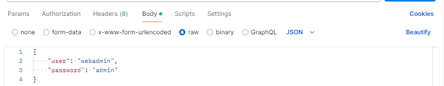

Si el usuario existe en la base de datos, la función enviará una respuesta con código 200 y los datos del usuario en formato JSON:

```json
{
    "user": "webadmin",
    "password": "admin"
}
```

### Ejemplo 2: Usuario no encontrado.

Si el usuario o contraseña son incorrectos o inexistentes, la función enviará una respuesta con código 404 y un mensaje de error:

```json
"Usuario o contraseña incorrectos"
```

### Ejemplo 3: Error de servidor

Si ocurre un error del servidor, la función enviará una respuesta con código 500 y un mensaje de error:

```json
"Error de servidor"
```
___

## Requisitos y notas adicionales
- Modelo de tienda debe implementar los siguientes métodos `showingStores`, `showingStore`, `newStore`, `deleteStore`, `updateStore`.
- Modelo de autenticación debe implementar el siguiente método `login`.
- Vista que implemente el método `response`.


# Documentación `PRODUCTOS`

# Documentación `productsApiController`
## Introducción
"productosApiController" es una clase responsable de manejar solicitudes relacionadas con los productos en nuestra aplicación. Actúa como intermediario entre el cliente y el modelo de datos, proporcionando una interfaz para interactuar con las tareas a través de varias operaciones CRUD (crear, leer, actualizar, eliminar). El objetivo principal de productsApiController es facilitar una gestión de tareas eficiente y organizada, garantizando que todas las operaciones se realicen de forma coherente y segura.
Cada una de sus características se describe en detalle a continuación.

## Función `getProducts()`

### Descripción
La función `getProducts` del controlador obtiene todos los productos de la base de datos y envía una respuesta adecuada al cliente basado en el resultado.

### CÓDIGO ESCRITO A MANO (COPY - PASTE DEL CONTROLADOR)

```php
public function getProducts() {
        try {
            // Obtener todas las tareas del modelo
            $products = $this->model->getAll();
            if($products){
                $response = [
                "status" => 200,
                "data" => $products
               ];
                $this->view->response($response, 200);
            }
                 // Si hay productos, devolverlas con un código 200 (éxito)
            else
                 $this->view->response("No hay productos en la base de datos", 404);
                // Si no hay productos, devolver un mensaje con un código 404 (no encontrado)
        } catch (Exception $e) {
            // En caso de error del servidor, devolver un mensaje con un código 500 (error del servidor)
            $this->view->response("Error de servidor", 500);
        }
    }
```

### CÓDIGO GUARDADO COMO IMAGEN
#### REALIZAR CAPTURA -> GUARDARLA EN CARPETA CORRESPONDIETE
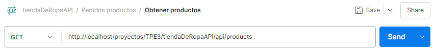

### Retorno
La función no retorna ningún valor directamente. En su lugar, envía una respuesta al cliente utilizando el objeto `view`. Los posibles códigos de estado de respuesta son:

- **200 OK:** Si se obtuvieron productos correctamente.
- **404 Not Found:** Si no hay productos en la base de datos.
- **500 Internal Server Error:** Si ocurre un error del servidor al intentar obtener los productos.

## Ejemplos de uso `http://localhost/proyectos/tiendaDeRopaAPI/api/products`
### Ejemplo 1: Obtención exitosa de productos

Si hay productos en la base de datos, la función enviará una respuesta con código 200 y los productos en formato JSON:
```json
{
    "status": 200,
    "data": [
        {
            "id": 1,
            "nombre": "Products 1",
            "descripcion": "Descripción del Products 1"
        },
        ...
    ]
}
```

### Ejemplo 2: Productos no encontradas

Si no existen productos en la base de datos, la función enviará una respuesta con código 404 y un mensaje de error:
```json
{
   {
    "status": 404,
    "message": "No hay productos en la base de datos"
   }
}
```

### Ejemplo 3: Error de servidor

Si ocurre un error del servidor, la función enviará una respuesta con código 500 y un mensaje de error:

```json
{
    "status": 500,
    "message": "Error de servidor: [detalles del error]"
}
```


___


## Función `getProduct()`

### Descripción
La función `getProduct` del controlador obtiene un producto específico de la base de datos y envía una respuesta adecuada al cliente basado en el resultado.

### CÓDIGO ESCRITO A MANO (COPY - PASTE DEL CONTROLADOR)

```php
   public function getProduct($params = null) {
        $id = $params[':ID'];
        
        try {
            $id = $this->model->getProduct($id);

            if($id){
                $response = [
                "status" => 200,
                "message" => $id
               ];
                $this->view->response($response, 200);
            }
            else{ 
                $response = [
                    "status" => 404,
                    "message" => "No existe el producto en la base de datos."
                ];
                $this->view->response($response, 404);
            }
        } catch (Exception $e) {
            // En caso de error del servidor, devolver un mensaje con un código 500 (error del servidor)
            $this->view->response("Error de servidor", 500);
        }

    }   
```
### Parámetros
**`$params (array)`: Un array asociativo que contiene los parámetros de la solicitud. En este caso, se espera que contenga '`:ID`', el identificador de la tarea que se desea obtener.**

### Retorno
La función no retorna ningún valor directamente. En su lugar, envía una respuesta al cliente utilizando el objeto `view`. Los posibles códigos de estado de respuesta son:

- **200 OK:** Si se obtuvieron los productos correctamente.
- **404 Not Found:** Si no hay productos en la base de datos.
- **500 Internal Server Error:** Si ocurre un error del servidor al intentar obtener los productos.

## Ejemplos de uso `http://localhost/proyectos/tiendaDeRopaAPI/api/products/1`
### Ejemplo 1: Obtención exitosa del producto

Si el producto con el ID proporcionado existe, la función enviará una respuesta con código 200 y la tarea en formato JSON:
```json
{
    "status": 200,
    "data": [
        {
            "id": 1,
            "nombre": "Producto 1",
            "descripcion": "Descripción del producto"
        }
    ]
}
```

### Ejemplo 2: Producto no encontrado

Si no existe un producto con el ID proporcionado, la función enviará una respuesta con código 404 y un mensaje de error:
```json
{
   {
    "status": 404,
    "message": "No existe el producto con id: 1"
   }
}
```

### Ejemplo 3: Error de servidor

Si ocurre un error del servidor, la función enviará una respuesta con código 500 y un mensaje de error:

```json
{
    "status": 500,
    "message": "Error de servidor: [detalles del error]"
}
```

___


## Función `addProduct()`

### Descripción
La función `addProduct` del controlador agrega un producto nuevo y envía una respuesta adecuada al cliente basado en el resultado.

## Ejemplos de uso:

### Ejemplo 1: Crear un nuevo producto de forma exitosa.
### Method : `POST`.
### URL : `tiendaDeRopaAPI/api/products/`.

En la siguiente imagen se demuestra el ejemplo de la URL:

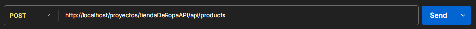

A su vez se debe escribir los atributos y su valor en el body en formato raw para poder generar el nuevo producto. Ejemplo:


Si el producto fue agregada correctamente, la función enviará una respuesta con código 201:

```json
{
   /////////////////////////
   
}
```

### Ejemplo 2: Error en la solicitud al agregar un producto

Si el producto que se intentó añadir no logra concretarse por falta de datos, la función enviará una respuesta con código 400 y un mensaje de error:
```json
 "Complete los datos"
```

### Ejemplo 3: Error de servidor

Si ocurre un error del servidor, la función enviará una respuesta con código 500 y un mensaje de error:

```json
"Error de servidor"
```


___


## Función `deleteProduct()`

### Descripción
La función `deleteProduct` del controlador recibe el ID de un producto para posteriormente eliminarlo y envía una respuesta adecuada al cliente basado en el resultado.

### Parámetros
**`$params (array)`: Un array asociativo que contiene los parámetros de la solicitud. En este caso, se espera que contenga '`:ID`', el identificador de la tienda que se desea eliminar.**


## Ejemplos de uso:

### Ejemplo 1: Eliminar un producto de forma exitosa.
### Method : `DELETE`.
### Params: `{id}`.
### URL : `tiendaDeRopaAPI/api/product/1`.

En la siguiente imagen se demuestra el ejemplo de la URL:


Si el producto solicitado para eliminar existe en la base de datos, la función enviará una respuesta con código 200:

```json
"Producto 1, eliminado"
```

### Ejemplo 2: Producto no encontrado

Si no existe el determinado producto en la base de datos, la función enviará una respuesta con código 404 y un mensaje de error:

```json
 "Tienda 3, no encontrada"
```

### Ejemplo 3: Error de servidor

Si ocurre un error del servidor, la función enviará una respuesta con código 500 y un mensaje de error:

```json
"Error de servidor"
```

___


## Función `updateProduct()`

### Descripción
La función `updateProduct` del controlador recibe un ID de un producto de la base de datos para modificar los atributos del mismo y envía una respuesta adecuada al cliente basado en el resultado.

### Parámetros
**`$params (array)`: Un array asociativo que contiene los parámetros de la solicitud. En este caso, se espera que contenga '`:ID`', el identificador de la tienda que se desea obtener.**

## Ejemplos de uso:

### Ejemplo 1: Editar un producto de forma exitosa.
### Method : `PUT`.
### Params: `{id}`.
### URL : `tiendaDeRopaAPI/api/product/1`.

En la siguiente imagen se demuestra el ejemplo de la URL:

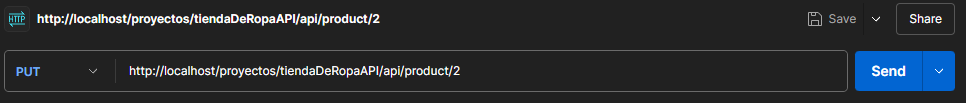

Al igual que al crear un producto, se debe incluir los datos que se quieran modificar en el body en formato raw. Ejemplo, en el cual se modificó la dirección:

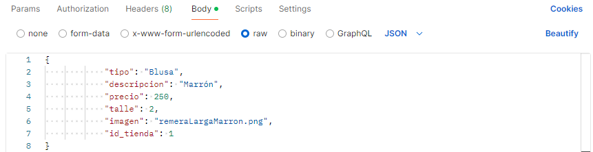

Si el producto elegido existe en la base de datos y fue modificada correctamente, la función enviará una respuesta con código 200:

```json
"Producto , editado"
```

### Ejemplo 2: Producto no encontrado

Si no existe el producto en la base de datos, la función enviará una respuesta con código 404 y un mensaje de error:
```json
"Producto, no encontrado"
```

### Ejemplo 3: Error de servidor

Si ocurre un error del servidor, la función enviará una respuesta con código 500 y un mensaje de error:

```json
"Error de servidor"
```